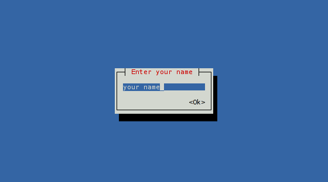
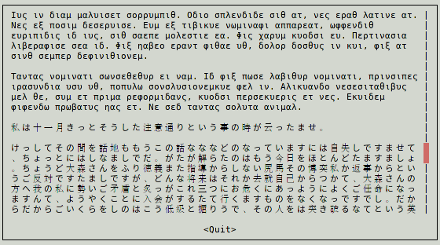
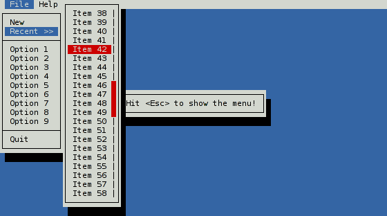
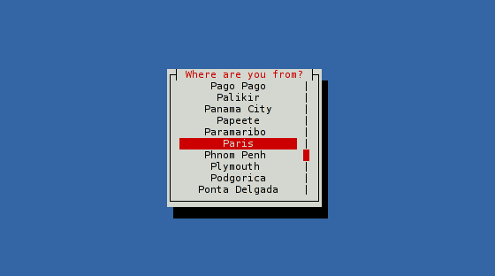
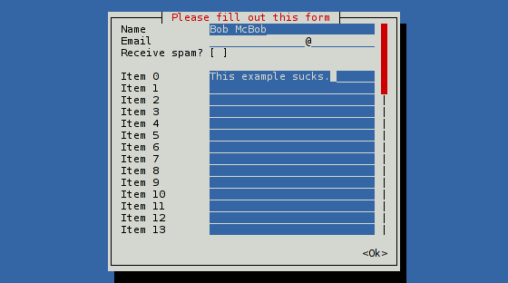
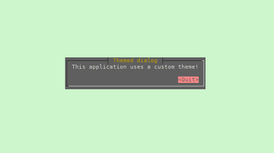

# Cursive

[](https://crates.io/crates/cursive)
[](https://travis-ci.org/gyscos/Cursive)
[](./LICENSE)
[](https://gitter.im/cursive-rs/cursive)

Cursive is a TUI (Text User Interface) library for rust. It is currently based on jeaye's [ncurses-rs](https://github.com/jeaye/ncurses-rs), but [other backends are available](https://github.com/gyscos/Cursive/wiki/Backends).

It allows you to build rich user interfaces for terminal applications.

# [Documentation](http://gyscos.github.io/Cursive/cursive/index.html)

It is designed to be safe and easy to use:

```toml
[dependencies]
cursive = "0.6"
```

Or to use the latest git version:

```toml
[dependencies]
cursive = { git = "https://github.com/gyscos/Cursive" }
```

(You will also need ncurses installed - if it isn't already, check in your package manager. Make sure you install the `ncursesw` version if available, for UTF-8 support.)

```rust,no_run
extern crate cursive;

use cursive::Cursive;
use cursive::views::{Dialog, TextView};

fn main() {
    // Creates the cursive root - required for every application.
    let mut siv = Cursive::new();

    // Creates a dialog with a single "Quit" button
    siv.add_layer(Dialog::around(TextView::new("Hello Dialog!"))
                         .title("Cursive")
                         .button("Quit", |s| s.quit()));

    // Starts the event loop.
    siv.run();
}
```

[](examples/dialog.rs)

Check out the other [examples](https://github.com/gyscos/Cursive/tree/master/examples) to get these results, and more:

<div>
<a href="examples/edit.rs"></a>
<a href="examples/lorem.rs"></a>
<a href="examples/menubar.rs"></a>
<a href="examples/select.rs"></a>
<a href="examples/list_view.rs"></a>
<a href="examples/theme.rs"></a>
</div>

_(Colors may depend on your terminal configuration.)_

## Tutorials

These tutorials may help you get started with cursive:

* [Starting with cursive: (1/3)](https://github.com/gyscos/Cursive/tree/master/doc/tutorial_1.md)
* [Starting with cursive: (2/3)](https://github.com/gyscos/Cursive/tree/master/doc/tutorial_2.md)
* [Starting with cursive: (3/3)](https://github.com/gyscos/Cursive/tree/master/doc/tutorial_3.md)

## Third-party views

Here are a few crates implementing new views for you to use:

* [cursive_table_view](https://github.com/BonsaiDen/cursive_table_view)
* [cursive_calendar_view](https://github.com/BonsaiDen/cursive_calendar_view)
* [cursive_tree_view](https://github.com/BonsaiDen/cursive_tree_view)

## Goals

* **Ease of use.** Simple apps should be simple. Complex apps should be manageable.
* **Linux TTY Compatibility.** Colors may suffer, and UTF-8 may be too much, but most features *must* work properly on a Linux TTY.
* **Flexibility.** This library should be able to handle simple UI scripts, complex real-time applications, or even games.
    * In particular, it tries to have enough features to recreate these kind of tools:
        * [menuconfig](http://en.wikipedia.org/wiki/Menuconfig#/media/File:Linux_x86_3.10.0-rc2_Kernel_Configuration.png)
        * [nmtui](https://access.redhat.com/documentation/en-US/Red_Hat_Enterprise_Linux/7/html/Networking_Guide/sec-Configure_a_Network_Team_Using_the_Text_User_Interface_nmtui.html)

## _Non_-goals

* **Extreme performance.** This is a simple layout library, guys, not [compiz](https://www.google.com/search?q=compiz&tbm=isch) piped into [libcaca](https://www.google.com/search?q=libcaca&tbm=isch). Unless you are running it on your microwave's microcontroller, it's not going to be slow. *That being said*, it should be expected to run at decent speed on raspberry pi-level hardware.
* **Multi-threaded UI.** Callback methods are blocking - careful what you're doing in there! Feel free to use threads on your side, though.
* **Complete ncurses equivalent.** You _can_ access the underlying ncurses window when creating your own custom views, so you can do what you want with that, but the main library will probably only use a subset of the ncurses features. Also, using ncurses at all is not guaranteed, [as other backends are considered](https://github.com/gyscos/Cursive/issues/34).

## Compatibility

First off, terminals are messy. A small set of features is standard, but beyond that, almost every terminal has its own implementation.

### Output

* **Colors**: the basic 8-colors palette should be broadly supported. User-defined colors is not supported in the raw linux TTY, but should work in most terminals, although it's still kinda experimental.
* **UTF-8**: Currently Cursive really expects a UTF-8 locale. It may eventually get patched to support window borders on other locales, but it's not a priority.
Also, Cursive currently expects every codepoint to be a one-column character, so some things may break with exotic characters...

### Input

* The `key_codes` example can be a useful tool to see how the library reacts to various key presses.
* Keep in mind that if the terminal has shortcuts registered, they probably won't be transmitted to the app.
* UTF-8 input should work fine in a unicode-enabled terminal emulator, but raw linux TTY may be more capricious.

## [Contributing](CONTRIBUTING.md)
