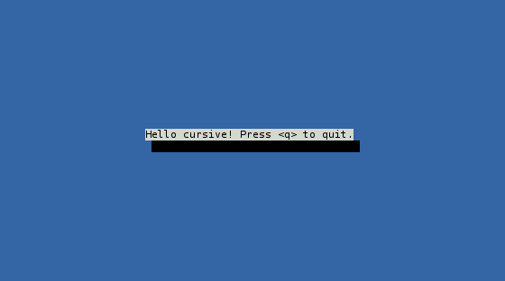

# Starting with cursive: (1/3)

## Target goal

In this first tutorial, we'll learn the basics of cursive,
and write a very basic first application:

```rust,no_run
use cursive::views::TextView;

fn main() {
	let mut siv = cursive::default();

	siv.add_global_callback('q', |s| s.quit());

	siv.add_layer(TextView::new("Hello cursive! Press <q> to quit."));

	siv.run();
}
```

Run the application, and you should have something like this:



Now that you have an idea of what we'll do, let's start from scratch.

## Project configuration

Let's create a new project
(this is basic cargo stuff I hope you're familiar with):

```text
% cargo new --bin cursive_example
```

Now, we'll add cursive to the list of dependencies in `Cargo.toml`:

```toml
[package]
name = "cursive_example"
version = "0.1.0"

[dependencies]
cursive = "*"
```

Finally, update `src/main.rs` to import it:

```rust,no_run
use cursive;

fn main() {
}
```

This simple application is now ready to use cursive. So let's do just that!

## The Cursive root

The cursive library is configured through a main [`Cursive`] root.
A typical cursive application will consist of three phases,
all centered around this object:

1. Create a `Cursive` object (we will use the [`cursive::default()`] method for that)
2. Configure the `Cursive` object
3. Run the `Cursive` object

Of these, the configuration phase is often the largest one,
so let's skip it for now.

In its simplest form, a cursive application is therefore:

```rust,no_run
fn main() {
	let mut siv = cursive::default();

	siv.run();
}
```

It's rather easy to identify the two steps involved.

If you run this, you'll get an empty blue terminal, with no way of properly
leaving the application (you'll have to press <kbd>Ctrl</kbd>+<kbd>C</kbd> to kill it).

[`cursive::default()`]: https://docs.rs/cursive/0/cursive/fn.default.html
[`Cursive`]: https://docs.rs/cursive/0/cursive/struct.Cursive.html

## Interactivity

Let's first add a way to stop the application. We want to quit when the user
presses the letter `q`.

Cursive sends an event for every user input; most of these are just ignored
and have no effect. The `Cursive` root has an [`add_global_callback`] method to
call a function anytime a certain event is fired.
This method takes 2 arguments: a trigger, and a callback.

* The trigger needs to implement `Into<event::Event>`. In addition to
  [`event::Event`] itself, this includes [`event::Key`], or simply `char`.
  These will trigger when the corresponding key (or letter) is pressed.
* The callback should be a function taking an `&mut Cursive` as an argument. Here,
  we want to quit, so we'll use [`Cursive::quit`] in a closure: `|s| s.quit()`.

In the end, we have:

```rust,no_run
fn main() {
	let mut siv = cursive::default();

	siv.add_global_callback('q', |s| s.quit());

	siv.run();
}
```

As expected, running it shows no visible change, but hitting the `q` key does
close the application.

[`add_global_callback`]: https://docs.rs/cursive/0/cursive/struct.Cursive.html#method.add_global_callback
[`event::Event`]: https://docs.rs/cursive/0/cursive/event/enum.Event.html
[`event::Key`]: https://docs.rs/cursive/0/cursive/event/enum.Key.html
[`Cursive::quit`]: https://docs.rs/cursive/0/cursive/struct.Cursive.html#method.quit

## Views

[`Views`] are the main components of the user interface in a cursive
application.  At their core, they define what to draw in a rectangle of the
terminal. For instance, a view can print a line of text, or a checkbox, etc.

Here, we'll be using a [`TextView`] to show a short message. `TextView` itself
can also deal with long text and do proper word-wrapping, but we won't need
that today.

The `TextView` constructor just takes the text to use: `TextView::new("...")`.

The `Cursive` root itself uses a [`StackView`] on the entire screen. This
`StackView` unsurprisingly stacks views in layers. It starts empty, so we'll
just need to add our `TextView` as a layer. [`Cursive::add_layer`] lets us do
exactly that.

Once we've added this line, our first application is complete:

```rust,no_run
use cursive::views::TextView;

fn main() {
	let mut siv = cursive::default();

	siv.add_global_callback('q', |s| s.quit());

	siv.add_layer(TextView::new("Hello cursive! Press <q> to quit."));

	siv.run();
}
```

[`Views`]: https://docs.rs/cursive/0/cursive/view/trait.View.html
[`TextView`]: https://docs.rs/cursive/0/cursive/views/struct.TextView.html
[`StackView`]: https://docs.rs/cursive/0/cursive/views/struct.StackView.html
[`Cursive::add_layer`]: https://docs.rs/cursive/0/cursive/struct.Cursive.html#method.add_layer

Next: [Starting with Cursive (2/3)](./tutorial_2.md)
