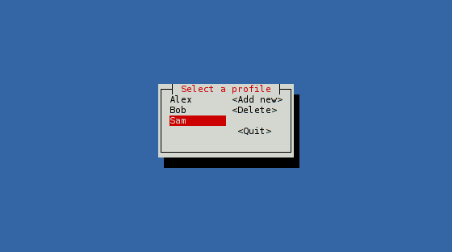

# Starting with cursive (3/3)

## Target goal

In this part, we'll introduce some mutability. Until now, we were adding
elements to the UI, and then we'd forget about them. This time, we'll remember
them to update them.

Here is the code we'll end up with:

```rust,no_run
use cursive::Cursive;
use cursive::views::{Button, Dialog, DummyView, EditView,
                     LinearLayout, SelectView};
use cursive::traits::*;

fn main() {
    let mut siv = cursive::default();

    let select = SelectView::<String>::new()
        .on_submit(on_submit)
        .with_name("select")
        .fixed_size((10, 5));
    let buttons = LinearLayout::vertical()
        .child(Button::new("Add new", add_name))
        .child(Button::new("Delete", delete_name))
        .child(DummyView)
        .child(Button::new("Quit", Cursive::quit));

    siv.add_layer(Dialog::around(LinearLayout::horizontal()
            .child(select)
            .child(DummyView)
            .child(buttons))
        .title("Select a profile"));

    siv.run();
}

fn add_name(s: &mut Cursive) {
    fn ok(s: &mut Cursive, name: &str) {
        s.call_on_name("select", |view: &mut SelectView<String>| {
            view.add_item_str(name)
        });
        s.pop_layer();
    }

    s.add_layer(Dialog::around(EditView::new()
            .on_submit(ok)
            .with_name("name")
            .fixed_width(10))
        .title("Enter a new name")
        .button("Ok", |s| {
            let name =
                s.call_on_name("name", |view: &mut EditView| {
                    view.get_content()
                }).unwrap();
            ok(s, &name);
        })
        .button("Cancel", |s| {
            s.pop_layer();
        }));
}

fn delete_name(s: &mut Cursive) {
    let mut select = s.find_name::<SelectView<String>>("select").unwrap();
    match select.selected_id() {
        None => s.add_layer(Dialog::info("No name to remove")),
        Some(focus) => {
            select.remove_item(focus);
        }
    }
}

fn on_submit(s: &mut Cursive, name: &str) {
    s.pop_layer();
    s.add_layer(Dialog::text(format!("Name: {}\nAwesome: yes", name))
        .title(format!("{}'s info", name))
        .button("Quit", Cursive::quit));
}
```



## SelectView

The main element in our application will be a list of names. For this, we'll
use a [`SelectView`]. This type is generic on the item stored. We just want
to store the names, so let's build a `SelectView<String>`:

```rust,ignore
let select = SelectView::<String>::new();
```

Our list will start empty. If we leave it like that, it will be tiny when
the application starts, and will grow when we add names. This is not very
professional-looking, so we'll give it a fixed size.

To do that, a [`ResizedView`] can wrap any view and give it a fixed size.
We could do:

```rust,ignore
let select = ResizedView::with_fixed_size((10, 5), SelectView::<String>::new());
```

But there is another shorter way: the [`Resizable`] trait is conveniently
implemented for any `View`, and allow to wrap in a `ResizedView` with a chainable
call. `Resizable`, and a few other useful traits, are conveniently bundled in
the [`traits`] prelude, ready to be imported:

```rust,ignore
use cursive::traits::*;

let select = SelectView::<String>::new()
    .fixed_size((10, 5));
```

We'll also want to add a callback when the user chooses a name. The
[`SelectView::on_submit`] method takes a callback with a second argument:
 the selected item. Since we're using `String`, our callback will have to be
 `Fn(&mut Cursive, &str)`:

```rust,ignore
let select = SelectView::<String>::new()
    .on_submit(on_submit)
    .fixed_size((10, 5));

fn on_submit(s: &mut Cursive, name: &str) {
    s.pop_layer();
    s.add_layer(Dialog::text(format!("Name: {}\nAwesome: yes", name))
        .title(format!("{}'s info", name))
        .button("Quit", Cursive::quit));
}
```

(Be sure to call `on_submit` on the `SelectView`,
not on the `ResizedView` returned by `fixed_size`!)

What we do there should be pretty familiar by now:
replace the layer with a simple dialog.

[`SelectView`]: https://docs.rs/cursive/0/cursive/views/struct.SelectView.html
[`ResizedView`]: https://docs.rs/cursive/0/cursive/views/struct.ResizedView.html
[`Resizable`]: https://docs.rs/cursive/0/cursive/view/trait.Resizable.html
[`traits`]: https://docs.rs/cursive/0/cursive/traits/index.html
[`SelectView::on_submit`]: https://docs.rs/cursive/0/cursive/views/struct.SelectView.html#method.on_submit

## Linear layouts

Our main screen is more complex than in our previous examples: it is made of
several views. There is a `SelectView` on the left, and three [`Button`]s to
the right. But our [`Dialog::around`] method only takes one view! How will we do this?

The solution is to use a layout view to display multiple children side-by-side.
[`LinearLayout`], for instance, can display views in a line.
We'll use two of them:

* One, set vertically, will hold the buttons on the right.
* Another one, horizontally, will contain the list and the vertical layout.

Let's start with the column of buttons:

```rust,ignore
let buttons = LinearLayout::vertical()
    .child(Button::new("Add new", add_name))
    .child(Button::new("Delete", delete_name))
    .child(DummyView)
    .child(Button::new("Quit", Cursive::quit));

fn add_name(s: &mut Cursive) {}
fn delete_name(s: &mut Cursive) {}
```

Buttons here take a regular callback. We're also adding a [`DummyView`] here:
this view doesn't do anything, it just occupies some space - we're using it
as a cheap spacer.

We can now create the second linear layout inside a Dialog:

```rust,ignore
siv.add_layer(Dialog::around(LinearLayout::horizontal()
        .child(select)
        .child(DummyView)
        .child(buttons))
    .title("Select a profile"));
```

We've added a `DummyView` again to add some space between the list and the
buttons. Though with an empty list, it doesn't look like much yet. Let's fill
this list with names!

[`Button`]: https://docs.rs/cursive/0/cursive/views/struct.Button.html
[`Dialog::around`]: https://docs.rs/cursive/0/cursive/views/struct.Dialog.html#method.new
[`LinearLayout`]: https://docs.rs/cursive/0/cursive/views/struct.LinearLayout.html
[`DummyView`]: https://docs.rs/cursive/0/cursive/views/struct.DummyView.html

## Identifying views

When the user presses the `<Add new>` button, we want to show a popup where he
can enter a new name:

```rust,ignore
fn add_name(s: &mut Cursive) {
    s.add_layer(Dialog::around(EditView::new()
            .fixed_width(10))
        .title("Enter a new name")
        .button("Ok", |s| {
            // What do we do now?...
        })
        .button("Cancel", |s| {
            s.pop_layer();
        }));
}
```

We're using [`EditView`] here, that we wrap in a fixed width like we did with
the `SelectView` earlier. We have an `<Ok>` button, but... what do we do there?

We need to fetch the content of the `EditView` from the callback, but we don't
have a reference to it. And if you try to declare a variable for the `EditView`
and use it in the closure, you'll soon be submerged by compiler errors, for
good reasons. But there is a way!

The closure has access to the `&mut Cursive`, which in turn has access to all
the views, so _in theory_, we could ask it to borrow the view, if only we knew
how to point to the correct view.

[`NamedView`] is meant exactly for this: it wraps a view and gives it a name.
Later, you can ask the Cursive root for this name and get access to the view.
Just what we need!

Like `ResizedView`, `NamedView` can be used directly with [`NamedView::new`], or through
the [`Nameable`] trait. [`Cursive::call_on_name`] allows you to run a closure
on the view.

Here's what it looks like in action:

```rust,ignore
fn add_name(s: &mut Cursive) {
    s.add_layer(Dialog::around(EditView::new()
            .with_name("name")
            .fixed_width(10))
        .title("Enter a new name")
        .button("Ok", |s| {
            let name = s.call_on_name("name", |view: &mut EditView| {
                view.get_content()
            }).unwrap();
        })
        .button("Cancel", |s| {
            s.pop_layer();
        }));
}
```

We create the `EditView` with the name `"name"`, and we use `"name"` again when
calling `call_on_name`.

Now we just need to do something with this name: add it to the list!
Remember the `SelectView` we created? Let's give it a name too:

```rust,ignore
let select = SelectView::<String>::new()
    .on_submit(on_submit)
    .with_name("select")
    .fixed_size((10, 5));
```
(Here again, the order is important: we want to wrap the `SelectView`, not
the `ResizedView`. But we still need to call `on_submit` before that.)

That way, we can update it with a new item:

```rust,ignore
fn add_name(s: &mut Cursive) {
    fn ok(s: &mut Cursive, name: &str) {
        s.call_on_name("select", |view: &mut SelectView<String>| {
            view.add_item_str(name);
        });
        s.pop_layer();
    }

    s.add_layer(Dialog::around(EditView::new()
            .on_submit(ok)
            .with_name("name")
            .fixed_width(10))
        .title("Enter a new name")
        .button("Ok", |s| {
            let name = s.call_on_name("name", |v: &mut EditView| {
                v.get_content()
            }).unwrap();
            ok(s, &name);
        })
        .button("Cancel", |s| {
            s.pop_layer();
        }));
}
```

Now that we know how to access the `SelectView`, removing an item is not very
complicated:

```rust,ignore
fn delete_name(s: &mut Cursive) {
    let mut select = s.find_name::<SelectView<String>>("select").unwrap();
    match select.selected_id() {
        None => s.add_layer(Dialog::info("No name to remove")),
        Some(focus) => {
            select.remove_item(focus);
        }
    }
}
```

We use [`SelectView::selected_id`] and [`SelectView::remove_item`] to remove
the item currently selected, nothing too surprising.

But this time, instead of using `call_on_name`, we use [`Cursive::find_name`]:
this method returns a handle, through which we can mutate the view.
It uses `Rc` and `RefCell` under the hood to provide mutable access to the
view without borrowing the `Cursive` root, leaving us free to pop layers.

[`EditView`]: https://docs.rs/cursive/0/cursive/views/struct.EditView.html
[`NamedView`]: https://docs.rs/cursive/0/cursive/views/struct.NamedView.html
[`NamedView::new`]: https://docs.rs/cursive/0/cursive/prelude/struct.NamedView.html#method.around
[`Nameable`]: https://docs.rs/cursive/0/cursive/view/trait.Nameable.html
[`Cursive::find_name`]: https://docs.rs/cursive/0/cursive/struct.Cursive.html#method.find_name
[`Cursive::call_on_name`]: https://docs.rs/cursive/0/cursive/struct.Cursive.html#method.call_on_name
[`SelectView::selected_id`]: https://docs.rs/cursive/0/cursive/views/struct.SelectView.html#method.selected_id
[`SelectView::remove_item`]: https://docs.rs/cursive/0/cursive/views/struct.SelectView.html#method.remove_item

## Conclusion

This tutorial was a bit larger than the previous ones, so take your time, and
don't hesitate to read the documentation.

You've now seen:
* How to wrap views to control their size
* How to assemble views together in a linear layout
* How to give names to views and use them later
* How to use `SelectView`, `EditView`, `Button`s...
